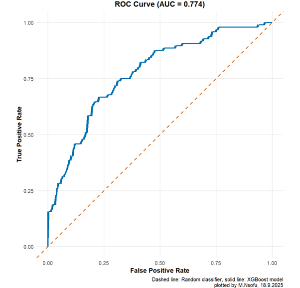

# German Credit Risk Analysis with XGBoost and mlr3

This repository contains an R script developed by **Mubanga Nsofu (18.09.2025)** to analyze the **German Credit dataset** using the **mlr3** ecosystem.  
The script demonstrates how to train and tune an **XGBoost classifier** with Bayesian optimization, and how to evaluate performance using both **ROC** and **Precision–Recall (PR)** curves.  
All plots are styled with the **Okabe–Ito color-blind friendly palette** for professional and accessible visualization.

---

## ✨ Features

- **Data**: German Credit dataset (`tsk("german_credit")` from `mlr3`).
- **Preprocessing**: One-hot encoding pipeline with `mlr3pipelines`.
- **Model**: Gradient boosting (`classif.xgboost`) tuned with **Bayesian optimisation** (`mlr3mbo`).
- **Evaluation**:
  - AUC-ROC and confusion matrices at different thresholds.
  - Precision, Recall, and F1-scores with threshold sweep.
  - ROC curve (XGBoost vs. random baseline).
  - Precision–Recall curve with **Average Precision (AP)**.
- **Visualization**: Plots styled using the **Okabe–Ito palette** for clarity and accessibility.

---

## 📊 Example Outputs

- **ROC Curve**  
  Shows model separability with AUC score.  
  Dashed line = random classifier.  

- **Precision–Recall Curve**  
  Highlights trade-offs between recall and precision.  
  Includes Average Precision (AP) and baseline prevalence line.  

---

## 🛠️ Requirements

This project uses **R (≥4.3)** and the following packages:

```r
install.packages(c(
  "mlr3", "mlr3learners", "mlr3tuning", "mlr3mbo",
  "mlr3pipelines", "mlr3viz", "ggplot2", "pROC", "rgenoud"
))
```

---

## 🚀 Usage

Clone the repository and run the script in R:

```bash
git clone https://github.com/RProDigest/Predictive-Modeling-.git
cd Predictive-Modeling-
Rscript German_Credit_XGBoost.R
```

The script will:
1. Train an XGBoost model on the German Credit dataset.
2. Auto-tune hyperparameters with Bayesian optimization.
3. Output AUC, recall, precision, F1, and confusion matrices.
4. Generate ROC and PR plots with Okabe–Ito styling.

---

## 📈 Model Evaluation  

The ROC curve shows that the tuned XGBoost model separates good and bad credit risks effectively. With an AUC of **0.774**, the model performs better than random guessing (AUC = 0.5). The curve stays above the diagonal baseline, confirming a good trade-off between true positive and false positive rates. This makes the model useful for ranking borrowers by risk and identifying likely defaulters.  

**Figure 2. ROC curve for XGBoost classifier on the German Credit dataset (AUC = 0.774).** The solid blue line represents the model’s performance, while the dashed orange line indicates a random classifier baseline (Author’s own, 2025).  

The Precision–Recall curve highlights performance for the defaulter class. The average precision of **0.632** is well above the baseline of 0.32, which reflects the share of defaulters in the dataset. The curve shows that the model captures many defaulters while keeping precision above the baseline, confirming its strength in handling class imbalance.  

**Figure 3. Precision–Recall curve for XGBoost classifier on the German Credit dataset (AP = 0.632).** The solid blue line represents the model’s precision–recall trade-off across thresholds, while the dashed orange line indicates the baseline precision, equal to the prevalence of defaulters (32%) (Author’s own, 2025).  


---

## 📖 Reference

If you use this repository, please cite:

- Nsofu, M. (2025) *Predictive Modeling – German Credit Risk Analysis with XGBoost and mlr3*. GitHub repository. Available at: <https://github.com/RProDigest/Predictive-Modeling-> (Accessed: 18 September 2025).  
- Bischl, B., Sonabend, R., Kotthoff, L. and Lang, M. (eds.) (2024) *Applied Machine Learning Using mlr3 in R*. Boca Raton: CRC Press. Available at: <https://mlr3book.mlr-org.com> (Accessed: 18 September 2025).  

---

## 👨‍💻 Author

Created by **Mubanga Nsofu**  
Date: *18 September 2025*  
Dataset: *German Credit Data*  
